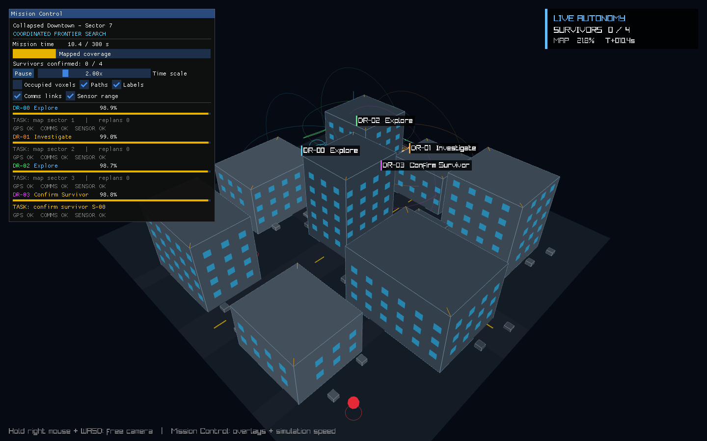

rescueswarm
-----------

rescueswarm is a multi-agent search-and-rescue autonomy simulator in C++20.
Four drones map a collapsed city block they have never seen, split the
exploration between them, detect and confirm survivors, replan around obstacles
as they are discovered, budget energy for the flight home, and keep working
through GPS, sensor and radio failures injected at random.

The simulator and the renderer are separate targets. The same mission runs as
an interactive raylib + Dear ImGui visualization, or headless at about 740x
real time for benchmarking. A fixed seed reproduces a mission exactly, down to
every detection, failure and task assignment.

Across 500 seeded missions: 500/500 completed, 100% of survivors found, zero
missions with a collision, and 95.6% of GPS-loss events recovered.



### Documentation quick links

* [Quick start](#quick-start)
* [Results](#results)
* [Autonomy](#autonomy)
* [Simulation](#simulation)
* [Failure injection](#failure-injection)
* [Visualization](#visualization)
* [Limitations](#limitations)
* [Tests](#tests)

### Requirements

macOS or Linux, a C++20 compiler and CMake 3.24+. Depends on raylib 6, Eigen,
nlohmann/json and Catch2. Dear ImGui and rlImGui are git submodules under
`third_party/`.

On macOS:

```
$ brew install cmake raylib eigen catch2 nlohmann-json
```

### Quick start

```
$ git clone --recursive https://github.com/agastya-choudhary123/rescueswarm
$ cd rescueswarm
$ cmake -S . -B build -DCMAKE_BUILD_TYPE=Release
$ cmake --build build -j
$ ./build/rescueswarm --scenario scenarios/city.json --seed 42
```

If you cloned without `--recursive`, run `git submodule update --init` before
building. On macOS you can instead double-click `Launch RescueSwarm.command`,
which builds if needed and starts the city mission.

The mission starts at 2x simulated time; the control panel pauses it or sets
anything from 0.25x to 8x. Hold the right mouse button and use WASD to move the
camera. Camera input only works while the button is held, so an unattended view
never drifts.

Headless runs use the same `World`, planner, sensors and state machines:

```
$ ./build/rescueswarm --scenario scenarios/city.json --seed 42 --headless
$ ./build/rescueswarm --scenario scenarios/city.json --benchmark 500 --headless
```

### Results

Apple M4, release build, 500 consecutive seeds of `scenarios/city.json`:

```
$ /usr/bin/time -p ./build/rescueswarm \
      --scenario scenarios/city.json --benchmark 500 --headless

Missions completed:       500/500
Mean area coverage:       83.8%
Survivors found:          100.0%
Collision rate:           0.0%
GPS-loss recovery rate:   95.6%
Mean completion time:     103.0 s
real 69.41
```

| metric | value | definition |
|---|---:|---|
| missions completed | 500/500 | every survivor confirmed and no drone lost |
| survivors found | 100.0% | confirmed survivors / placed survivors |
| collision rate | 0.0% | missions with at least one collision, not collisions per mission |
| GPS-loss recovery | 95.6% | GPS outages the drone recovered from before the mission ended |
| area coverage | 83.8% | known free volume / true free volume |
| mean completion | 103.0 s | simulated time until the team lands |

The 500 runs cover 51,500 seconds of simulated flight in 69.4 s of wall-clock
time. That is 7.2 complete missions per second, with the engine running about
740x faster than real time.

Nothing is scripted. Every run steps the same 30 Hz simulation the GUI uses
until the team lands or time runs out, and the metrics are read from the final
world state. The failure-free `training.json` scenario finishes in 39.5 s with
99.0% coverage.

### Autonomy

Each drone carries its own kinematic state, mission state, planned path,
battery budget, sensor and radio health, sector assignment and, optionally, a
survivor task.

```
                         survivor assigned
                                │
Idle ──► Explore ───────────────► Investigate ──► Confirm Survivor
             │                         │                  │
             │ new obstacle            └──── replan ──────┘
             ▼
      Avoid Obstacle ──► Replan
             │
             └──────── low energy ──► Return to Base ──► Land
```

**Exploration.** LiDAR observations update a 3D occupancy grid. A frontier is
a known-free cell on the operational flight layer next to unknown space. Each
candidate frontier is scored on:

* expected information gain over a 5 x 5 neighborhood;
* A* distance from the drone;
* whether it lies in the drone's assigned sector; and
* distance from teammates' current targets.

Frontiers are limited to the operational layer on purpose. An earlier version
counted every unknown air voxel as worth exploring and spent most of its search
budget mapping empty sky above the buildings. The grid and the planner are
still fully 3D. Only the exploration objective encodes where survivors can
actually be.

**Task allocation.** When any drone detects a survivor, a central allocator
picks one eligible drone based on travel distance, remaining battery and radio
state. The assignment is exclusive, so nearby teammates keep working their
sectors instead of flying to the same survivor. The chosen drone switches to
`Investigate`, follows a 3D A* path, confirms the survivor from within 2.2 m,
and goes back to exploring.

**Replanning and energy.** A path is invalidated the moment sensing marks its
next voxel occupied. The drone brakes before entering that cell and replans on
the updated map, and short-range separation forces keep it clear of teammates
and structures. The decision to return home uses an energy reserve based on the
distance to base, not a fixed battery threshold.

### Simulation

`SimulationClock` accumulates render-frame time and advances the world in fixed
30 Hz steps. Frame rate therefore changes how smooth the view looks, never the
trajectories or the results.

Each drone has 3D position, velocity, acceleration and orientation, with
bounded acceleration and speed. The model is kinematic on purpose: the project
is about planning, coordination and failure recovery, not tuning a flight
controller.

Scenarios are JSON files:

| scenario | grid | structures | drones | survivors | failures |
|---|---|---:|---:|---:|---|
| `city.json` | 40 x 12 x 40 voxels, 1 m | 10 | 4 | 4 | on |
| `training.json` | 20 x 8 x 20 voxels, 1 m | 2 | 2 | 2 | off |

Each scenario also sets the base location, a time limit (300 s for the city,
120 s for training) and per-second failure probabilities. `training.json` is
the failure-free scenario the correctness tests use.

`rescueswarm_core` does not use any raylib or ImGui types, so tests and
benchmarks link against it without ever opening a window.

### Failure injection

The city scenario injects three independent failures on every simulation tick:

| failure | probability / s | effect |
|---|---:|---|
| GPS loss | 0.008 | tracked explicitly, counted toward the recovery rate |
| sensor dropout | 0.004 | no occupancy or survivor observations; current path continues until sensing returns or a known obstacle invalidates it |
| comms dropout | 0.012 | drone keeps working its sector alone and becomes a costly choice for remotely reported survivors |

Failed subsystems recover at random, so how long an outage lasts differs from
seed to seed.

### Visualization

The renderer is built to show what the autonomy is doing, not to look
photorealistic:

* color-coded quadrotors with state labels, trajectories and A* waypoints;
* mission targets, survivor pulses and detection beacons;
* LiDAR range rings and live communication links between drones;
* procedurally generated buildings, windows, roads and rubble;
* an optional overlay of occupied voxels; and
* a Dear ImGui panel with live battery, task ownership, replans, sensor health,
  coverage and mission progress.

The default camera frames the whole city and stays put until you take control
with the right mouse button. Labels are projected from world coordinates after
the 3D pass, so a drone stays identifiable even when a building partly hides
it.

### Limitations

Every drone reads the same in-process map. Radio state affects task allocation
and telemetry, but drones do not keep their own diverging maps or merge them
after losing contact. A truly distributed allocation experiment needs one
occupancy map and frontier set per drone.

Survivor detection uses range plus a random chance, with no line of sight, so
buildings block neither the LiDAR nor the survivor detector. LiDAR reveals a
sphere of voxels rather than casting individual rays.

A* replans from scratch. D* Lite is the natural next planner, because most
updates touch only a small part of the voxel graph.

Flight is kinematic, buildings are axis-aligned boxes, and the damage is only
visual. There are no rotor dynamics, no wind, no debris physics and no contact
solver.

The benchmark compares seeds, not planners. Comparisons such as A* against
D* Lite, or centralized against distributed allocation, will only be reported
once both options exist and run through the same scenario harness.

### Tests

```
$ ctest --test-dir build --output-on-failure

100% tests passed, 0 tests failed out of 6
```

| file | checks |
|---|---|
| `planner_tests.cpp` | 3D A* routes around occupied voxels; blocked goals are rejected |
| `state_machine_tests.cpp` | low battery forces return and landing; detections trigger investigation; frontiers stay at operational altitude |
| `scenario_tests.cpp` | scenarios load, and two worlds with the same seed evolve identically |

### Layout

```
include/rescueswarm/
  autonomy/       state transitions, frontier scoring, allocation, avoidance
  planning/       voxel occupancy grid and 3D A*
  sensors/        LiDAR, GPS and survivor detector interfaces
  simulation/     world, drones and fixed-step clock
  telemetry/      mission and aggregate metrics
  rendering/      renderer interface only
src/
  autonomy/       team policy and recovery behavior
  planning/       search and grid implementations
  sensors/        noisy sensor models
  simulation/     headless mission engine
  rendering/      raylib + Dear ImGui client
  app/            CLI, benchmark and interactive entry point
scenarios/        JSON mission definitions
tests/            Catch2 planner, state-machine and scenario tests
third_party/      Dear ImGui and rlImGui (submodules)
```
